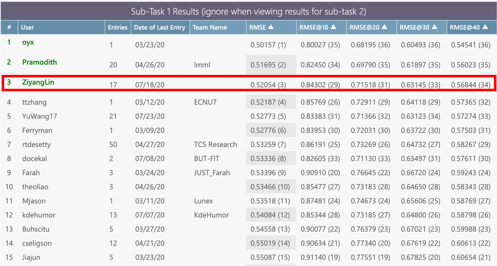
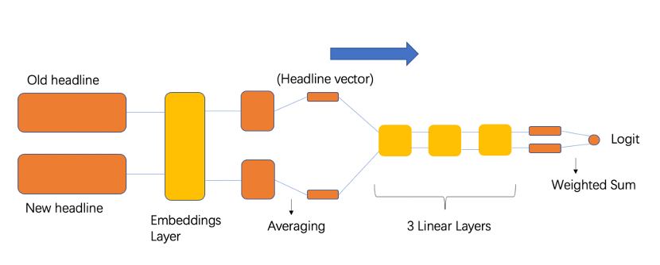
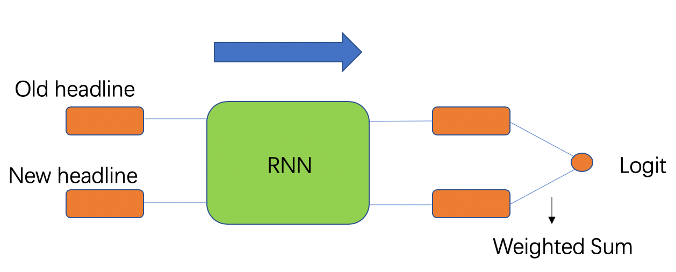
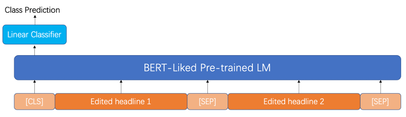

2020 NLP Funniness Estimation - PyTorch
========================================
This project aims to develop potential solutions for the tasks rised by the competition 
[`Assessing the Funniness of Edited News Headlines (SemEval-2020)`][competition] on the platform [CodaLab]

As of July 26, 2020, the test result of my trained model ('bert-base-uncased' from the [Huggingface transformers]) `ranked third` in the ranking of 
Post Evaluation Task 1 on the CodaLab

 

## Code versions
|Model|Task One|Task Two|
|:--:|:--:|:--:
|Two Inputs FFNN|[Funniness_Estimation.ipynb]|
|Two Inputs CNN & Two Inputs RNN|[Funniness_Estimation_2nd_version.ipynb]|
|Pre-trained LMs|[Funniness_Estimation_Regression_Task_1.ipynb]|[Funniness_Estimation_3rd_version.ipynb]
|Pre-trained LMs with a fake task||[Funniness_Estimation_4rd_version.ipynb]

********

  
  

|Author|Ziyang Lin|
|---|---
|Personal Page|[![personal-page-shield]][personal-page]

## Contents
* [Tasks Description](#tasks-description)
* [Data Preprocessing](#data-preprocessing)
* [Models Choices & Design](#models-choices--design)
* [Design of Training Processes (for task two only)](#design-of-training-processes-for-task-two-only)
* [Optimizer & Learning Rate Scheduler](#optimizer--learning-rate-scheduler)
* [Prime Hyperparameters](#prime-hyperparameters)
* [Results](#results)
* [Discussion](#discussion)
* [Prospective](#prospective)
* [License](#License)

## Tasks Description
* `Task one` - Given one edited headline, design a regression model to predict how funny it is
* `Task two` - Given the original headline and two manually edited versions, design a model to predict which edited version is the funnier of the two

## Data Preprocessing
### Task One
* Convert original headlines into normal sentences (Remove “<” and “/>” by applying RE)
* Get the edited version of headlines by doing word substitution using RE
* Do tokenization and lowercasing for each edited-original headlines pair

  Data preprocessing for pre-trained LMs (BERT-liked LMs):
  * Version 1 - Concatenate original headlines and new headlines
  * Version 2 - Concatenate new headlines and new words
  * Version 3 – Contain only new headlines

### Task Two
There are 3 versions of data preprocessing:
  * The normal version
  * The headlines truncated version
  * The punctuation removal version  

## Models Choices & Design
### Task One
* Two Inputs FFNN
* Two Inputs CNN
* Two Inputs RNN
* Two Inputs Concatenated RNN
* Pre-trained LM + a regression layer (LMs applied: BERT, ALBERT, XLNet, ELECTRA)

#### Two Inputs FFNN
This model is a two inputs’ feed forward neural network in which two input matrices representing all the original headlines and their corresponding 
edited headlines respectively are passed simultaneously to the first so called embedding layer of the model to get the word embedding of the fixed 
dimension for each word in the headline. Following above the model will do averaging for each headline to get the ‘document representation (vector)’ 
for each headline. Then these headlines’ vector representations are passed to a combination of three concatenated fully connected layers where the 
information about “how humour they are” are encoded. The Relu activation is applied after output from each of the first two hidden layers to prevent 
gradient vanishing and gradient exploding. Finally, all weighted sums or all vector products between the n-th row of the original matrix and the n-th 
row of the edited matrix are computed such that a vector with the size (origin_headlines_num, 1) is returned.  

 

#### Two Inputs CNN
This model uses text CNN architecture with single windows size instead of FFNN for the regression task. The original headlines tensor and the edited 
headlines tensor are taken as the two inputs. In the output layer, unlike the normal matrix multiplication, all weighted sums or all vector products 
between the n-th row of the original matrix and the n-th row of the edited matrix are computed such that a vector with the size (origin_headlines_num, 1) 
is returned.  

 

#### Two Inputs RNN
This model uses single layer bidirectional RNN architecture for the regression task. It is again the same as Two Inputs CNN that takes two tensors as its 
inputs and does a row-wise weighted summation in the output layer.  

 

#### Two Inputs Concatenated RNN
This model is all the same as Two Inputs RNN except it concatenates the two last hidden states for the original headlines and the edited headlines to form 
a single representation and do a normal matrix multiplication in the output layer.

#### Pre-trained LM + a regression layer (LMs applied: BERT, ALBERT, XLNet, ELECTRA)
##### Version 1 - Concatenate original headlines and new headlines  

 

##### Version 2 - Concatenate new headlines and new words  

 

##### Version 3 – Contain only new headlines  

 

### Task Two
#### Pre-trained LM + a classification layer
##### Concatenate edited headline 1 and edited headline 2

 

## Design of Training Processes (for task two only)
### Version 1:
* Training the model “Pre-trained LM + a classification layer”
straightly for the real classification task 
### Version 2 (Fake Task + Real Task):
* Firstly, training the model “Pre-trained LM + a regression layer” for a fake regression task on the training dataset
* After training well, get rid of the regression layer and add an initialized classification layer on top of the pre-trained LM
* Finally training the model for the real classification task

## Optimizer & Learning Rate Scheduler
### For FFNN, CNN, RNN:
* The optimizer ‘AdamW’ and the scheduler ‘CosineAnnealingLR’ provided by pytorch
### For pre-trained LMs (BERT-liked LMs):
* The optimizer ‘AdamW’ and the scheduler ‘get_linear_schedule_with_warmup’ from [Huggingface transformers]

## Prime Hyperparameters
* Learning Rate
* Fine-tuning Rate
* Adam Epsilon
* Weight Decay
* Warmup Ratio
* Number of Steps

## Results
### Task One
#### Best performance achieved by Two Inputs FFNN
|EPOCHS|LRATE|EMBEDDING_DIM|HIDDEN_DIM_1|HIDDEN_DIM_2|HIDDEN_DIM_3|Train Loss|Val. Loss|Test Loss|
|---|---|---|---|---|---|---|---|---
|100|0.145|300|100|50|10|0.575|0.581|0.576

#### Best performance achieved by Two Inputs CNN
|EPOCHS|LRATE|EMBEDDING_DIM|FC_OUT_DIM|N_OUT_CHANNELS|WINDOW_SIZE|DROPOUT|Train Loss|Val. Loss|
|---|---|---|---|---|---|---|---|---
|500|5e-3|50|25|100|3|0.7|0.624|0.661|

#### Best performance achieved by Two Inputs RNN
|EPOCHS|LRATE|EMBEDDING_DIM|HIDDEN_DIM|FC_OUTPUT_DIM|BIDIRECTIONAL|DROPOUT|Train Loss|Val. Loss|Test Loss|
|---|---|---|---|---|---|---|---|---|---
|30|1e-4|50|128|32|Ture|0.3|0.586|0.576|0.571

#### Best performance achieved by Pre-trained LMs
* WithoutDataAugmentation
  * Model: bert_base_uncased
  * Inputs structure: new headlines + new words
  * Test loss: 0.52937
* With Data Augmentation (add “funlines” training dataset)
  * Model: bert_base_uncased
  * Inputs structure: new headlines + new words
  * `Test loss: 0.52054 (Best performance achieved. among all trials)`

| ![task1_log][task1_log] | 
|:--:| 
| *T1 Pre-trained LMs Log* |

### Task Two
#### Version 1: Straightly training the model for the real task
| ![task2_v1_log1][task2_v1_log1] | 
|:--:| 
| *T2 Log 1* |

| ![task2_v1_log2][task2_v1_log2] |
|:--:| 
| *T2 Log 2* |

#### Version 2: Fake Task Training + Real Task Training
| ![task2_v2_f_log][task2_v2_f_log] | 
|:--:| 
| *T2 Fake Task Log* |

| ![task2_v2_r_log][task2_v2_r_log] |
|:--:|
| *T2 Real Task Log* |

## Discussion
### Task One
* The performance of Two Inputs RNN is just slightly better compared with that of the Two Inputs FFNN (0.5759702196 vs. 0.5751694002) while the time complexity 
of the Two Inputs RNN is much higher than the Two Inputs FFNN, at some point the current version of Two Inputs RNN is resources-wasted.
* The Two Inputs CNN with a single window size performs worse than the Two Inputs FFNN and the Two Inputs RNN, and one of possible reasons is that it only looks 
at one size of n-gram and hence ignores the knowledge of n-grams with different lengths.

### Task Two
* For different preprocessing methods, the headlines truncated version and the punctuation removal version have the same performance as the normal one except 
that truncating headlines will reduce the training time for a single epoch.
* The issue of overfitting on the training dataset is hard to overcome when applying BERT-liked pre-trained LMs (Although several methods, such as data 
augmentation, weight decay and dropout increase have been tried to mitigate this problem.
* Surprisingly, the fake task training for pre-trained LMs does not help to improve the performance of the model in real task even a little bit.
* With the same hyperparameters setting for the certain task, the performance of the newly proposed pre-trained LM is not necessarily the best.

## Prospective
* Construct a pretrain LM to do a binary classification task in which the model learns to decide whether a word from the edited new headline is original or 
edited. Take the embeddings out of the pretrain model and use it to initialize the model for the real regression task. By doing so we expect the embeddings can 
be informed some knowledge about the relationship between original headlines and edited headlines.
* Build up a pretrain LM to do a text translation task on the training dataset and use the embeddings of this model to initialize the model for the real 
regression task. (Aim to learn the semantics of funniness).
* Intuitively thinking the performance of the Two Inputs CNN might be improved by increasing the number of the window sizes (different n-gram filters).
* Applying the pre-trained LM Longformer rather than other BERT-liked models for the task two, in which the Longformer has the ‘global attention mask’ and it 
can probably better model the relationship between the edited word and the other words in a headline (e.g. `How important is the edited word for the whole 
headline in order to make it funnier?` / `How does the edited word contribute to the meaning of the whole sentence?`).

## License
This project following MIT License as written in the [LICENSE] file.

------------------------------------------------------------
[competition]:https://competitions.codalab.org/competitions/20970#learn_the_details "competition"
[CodaLab]:https://competitions.codalab.org "competition"
[personal-page]:https://ziyanglin.netlify.app "Ziyang Lin's page" 
[personal-page-shield]:https://img.shields.io/badge/MySite-ZiyangLin-blue
[Huggingface transformers]:https://huggingface.co/transformers/index.html "huggingface"
[LICENSE]:./LICENSE
[Funniness_Estimation.ipynb]:./subtask-1/code/Funniness_Estimation.ipynb
[Funniness_Estimation_2nd_version.ipynb]:./subtask-1/code/Funniness_Estimation_2nd_version.ipynb
[Funniness_Estimation_Regression_Task_1.ipynb]:./subtask-1/code/Funniness_Estimation_Regression_Task_1.ipynb
[Funniness_Estimation_3rd_version.ipynb]:./subtask-2/code/Funniness_Estimation_3rd_version.ipynb
[Funniness_Estimation_4rd_version.ipynb]:./subtask-2/code/Funniness_Estimation_4rd_version.ipynb
[task1_log]:./images/task1_log.png
[task2_v1_log1]:./images/task2_v1_log1.png
[task2_v1_log2]:./images/task2_v1_log2.png
[task2_v2_f_log]:./images/task2_v2_f_log.png
[task2_v2_r_log]:./images/task2_v2_r_log.png
